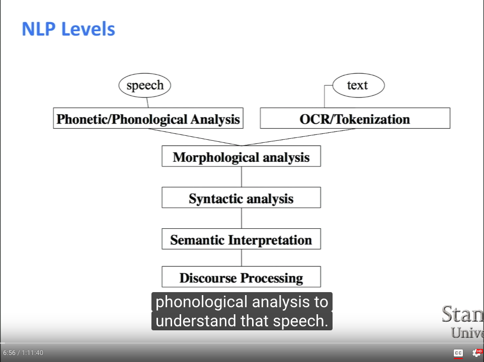
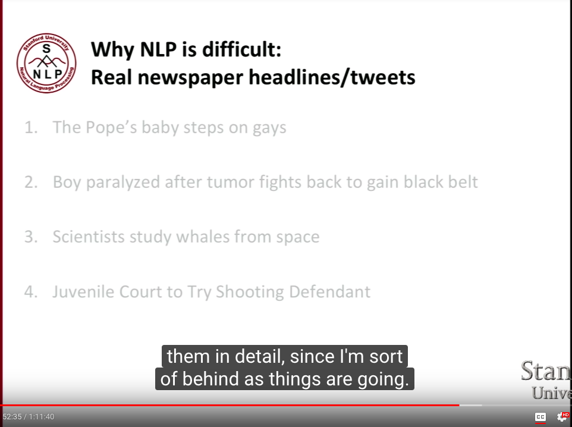
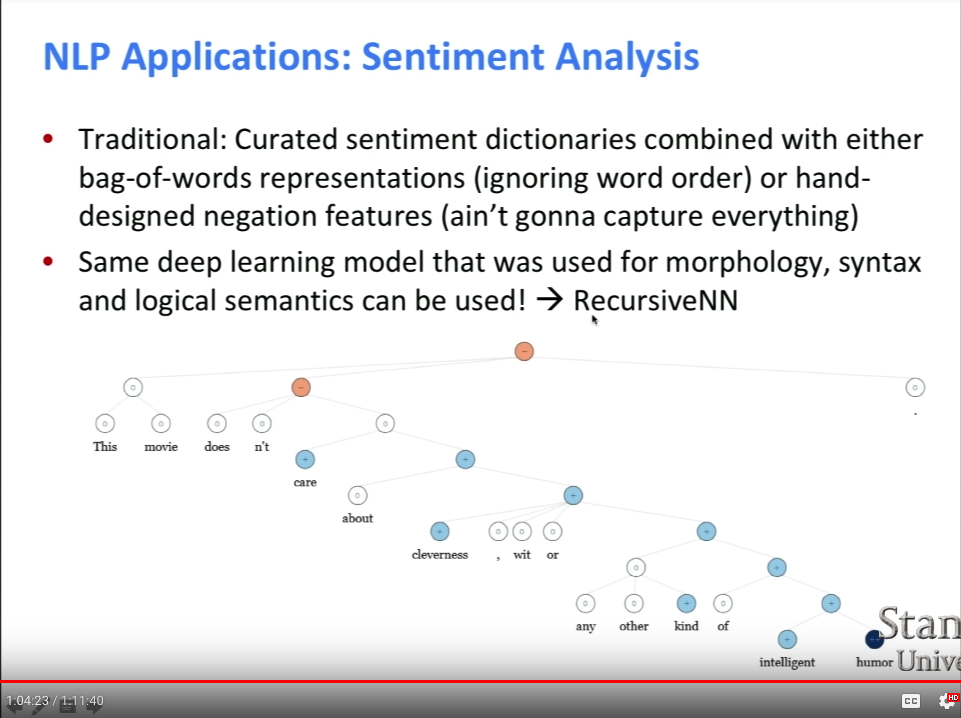
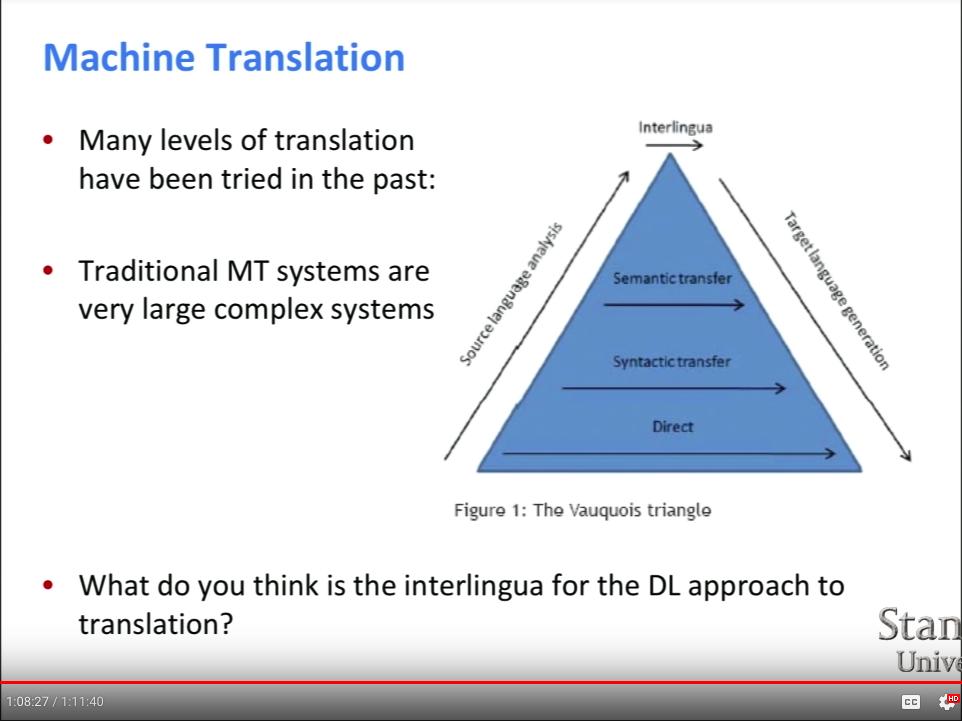
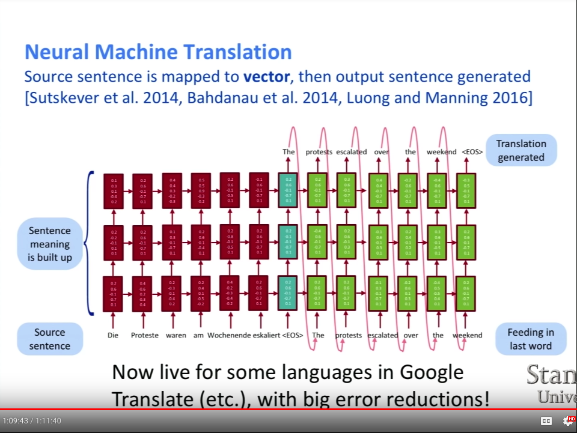

```{r setup, include=FALSE}
library(knitr)
library(glue)

opts_chunk$set(warning = FALSE)
opts_chunk$set(message = FALSE)
opts_chunk$set(echo    = FALSE)
```

# Lecture 1 | Natural Language Processing with Deep Learning
Lecture URL: https://www.youtube.com/watch?v=OQQ-W_63UgQ&list=PL3FW7Lu3i5Jsnh1rnUwq_TcylNr7EkRe6

#### Intro  
* question answering -- major use case  
* Apple Siri -- start of an arms race  

```{r, fig.align='center'}

```

* This class: syntactic analysis / semantic interpretation  

#### On Applications
* Easy Applications: spell checking, keyword search, finding synonyms  
* Hard: Machine Translation, Spoken Dialog Systems, Complex Question Answering (e.g. understand Wikipedia)  

* NLP industry take-off: search, ad matching, translation, sentiment analysis for trading, speech recog., chatbots  

#### Human Language

* Symbolic!  
* Symbols are communicated in many different ways (e.g. sound, gesture, writing)  
* Languages -- huge vocabularies. 10K --> 100K range  


#### DL

* ML: need of human-designed representations / features --> machine was not really "learning", it only did numeric optimization. 90% humans figuring out those features.  
* Google search worked like this until ~ 2015!  

* DL: representation learning.  
* Invents its own "features".  
* [Deep Learning in Neural Networks: An Overview](https://arxiv.org/abs/1404.7828) -- good history of DL  


* lot of key techniques were invented in the 80s and 90s!  
* large amounts of training data favor DL  
* compute power becoming available as well (GPUs)  
* (we also had new algos, etc.)
* 2010: [Context-Dependent Pre-Trained Deep Neural
Networks for Large-Vocabulary Speech Recognition](https://www.microsoft.com/en-us/research/wp-content/uploads/2016/02/dbn4lvcsr-transaslp.pdf)
* Then 2012 -- ImageNet paper (also Toronto uni!)


#### Course logistics
* Class homepage: http://stanford.edu/class/cs224n/  
* reading materials & student submissions! check out!  

#### Why is NLP hard?
* human languages are ambiguous  
* slow channel, but works very efficiently as the interpreter fills in a lot of "not said" things from contextual knowledge  

```{r, fig.align='center'}

```


#### NLP vs DL

* word representation: as a vector of numbers (might be 25-300-1000 dimensions)  
* good semantic vector spaces  
* have to project down to 2D / 3D for humans to see... (so don't try to understand those axes, and note it can be misleading!) -- PCA  

* DL: big success were traditional methods have failed  

```{r, fig.align='center'}

```

* recurrent neural networks -- recognize that "doesn't" negates all the positive words coming after it, something that simple bag-of-words can't do  

* Google Inbox suggested replies  
* Machine Translation  

```{r, fig.align='center'}


```

